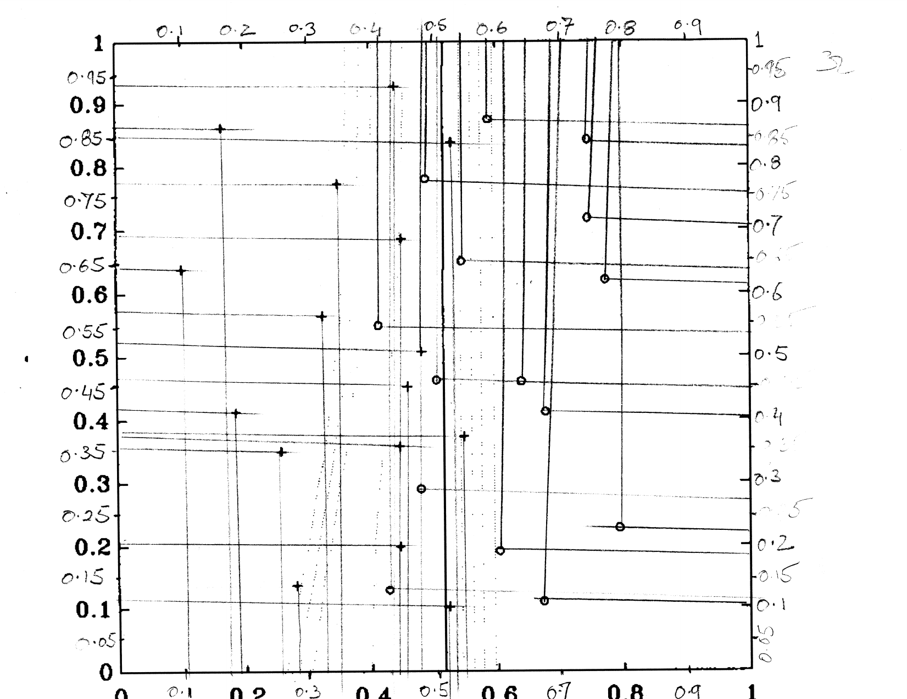
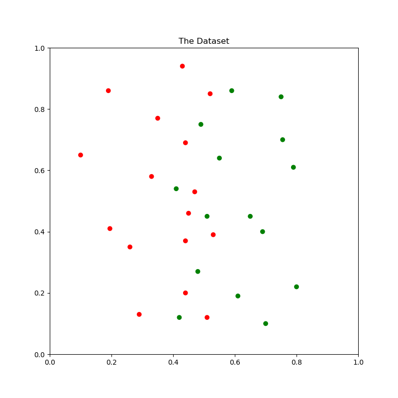
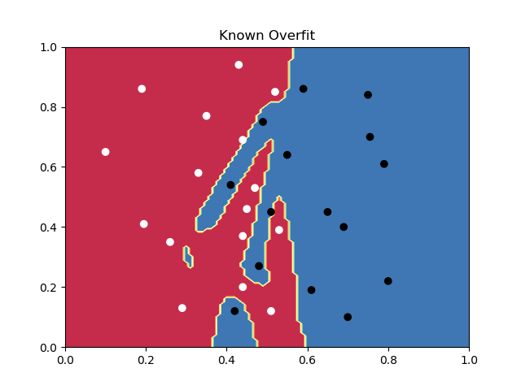
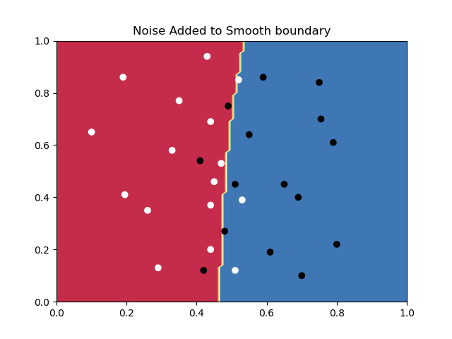

# Training With Noise Reduces Overfitting

In the presence of small datasets, overfitting is a likely outcome meaning that the model does not generalize very well to test data. In this example, we highlight a simple and powerful way to reduce overfitting.

## The Dataset

Our dataset has only 31 two-dimensional points distributed equally adross two classes. I came across this dataset in Russell Reed's seminal book, Neural Smithing (page 282). The data isn't available on a website, so I had to recreate it by hand (it was fun to once again work with a ruler and pencil). See my handiwork below. The two classes are resresented by the '+' and 'o' symbols. 



Going through an analog to digital conversion, we get a dataset of 31 point across two classes (`points-two-classes.csv`):



## The Model

The model is a very simple 2/50/10/1 MLP network, the same used the Russell's book. Note, I've (unknowingly) switched the hidder layer's; to `10-50` instead of `50-10`, which is probably why the decision boundary does the look the same as in the book.

```
class ThreeLayerNLP(torch.nn.Module):
    def __init__(self):
        super().__init__()
        self.layer1 = torch.nn.Linear(2, 10)
        self.layer2 = torch.nn.Linear(10, 50)
        self.output = torch.nn.Linear(50, 1)

    def forward(self, x):
        x = torch.tanh(self.layer1(x))
        x = torch.tanh(self.layer2(x))
        out = torch.sigmoid(self.output(x))
        return out
```

## Trained to Intentionally Overfit

Per Russell, "With 671 weights, but only 31 training points, the network is very underconstrained and chooses a very nonlinear boundary". And it does turn out that way as you can see below.



## Smoothing with Jitter

Per the book, training with jittered data discourages sharp changes in the response near the training points and so discurages the network from overly complex boundaries. Following the guidance from the book, we do not change any of the hyperparameters, except, during training, we jitter the data as we feed them into the net.

The function to jitter the input is specified beow.

```
def add_gauss_noise(point, sigma):
    noise_x = torch.tensor(np.random.normal(0, sigma, point.shape[0]),
                           dtype=torch.float32)
    noise_y = torch.tensor(np.random.normal(0, sigma, point.shape[0]),
                           dtype=torch.float32)
    point = point + torch.cat([noise_x, noise_y]).reshape(point.shape)
    return point
```

We notice that, for the same number of epochs and the same batch-size (effectively the same hyperparamters), the training regime is unable to overfit on the meager data (however hard we try).


